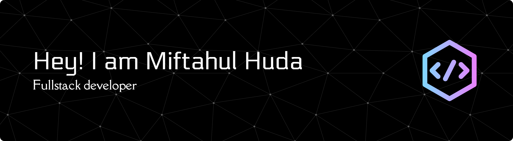

### Hello Wordl! I'm Miftahul Huda
Hi there! My name is Miftahul Huda, a Full-Stack Web Developer specializing in the Laravel and React.js ecosystem. I am passionate about designing and developing web applications that are scalable and user-friendly.  On the back end, I'm skilled in building robust REST APIs using Node.js and Express.js, and managing databases with MySQL and MongoDB. On the front end, I'm proficient in React.js and Inertia.js to create interactive and responsive interfaces.  You can find my various projects here, ranging from an integrated Student Achievement Information System to an efficient Supply Chain Management System. These projects demonstrate my ability to translate business needs into effective, functional features.  I am always open to collaboration and ready to take on new challenges in developing innovative products.

#### 🌐 Socials:
  

#### 💻 Tech Stack:
                                        
#### 📊 GitHub Stats:
 
 

#### 🏆 GitHub Trophies

<!-- Proudly created with GPRM ( https://gprm.itsvg.in ) -->